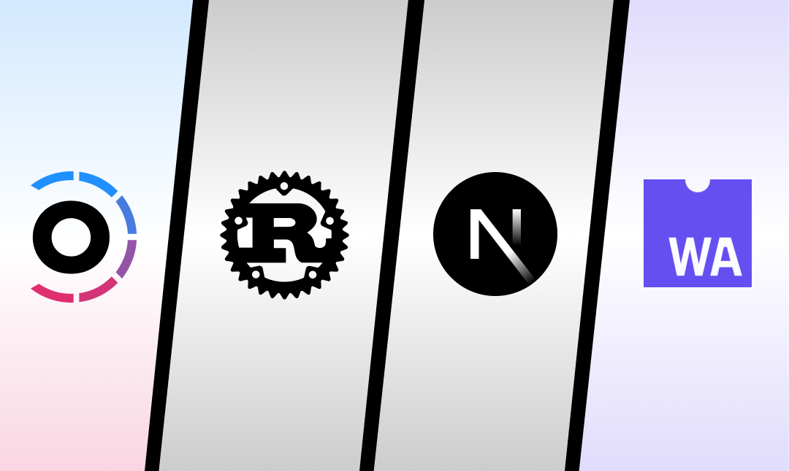
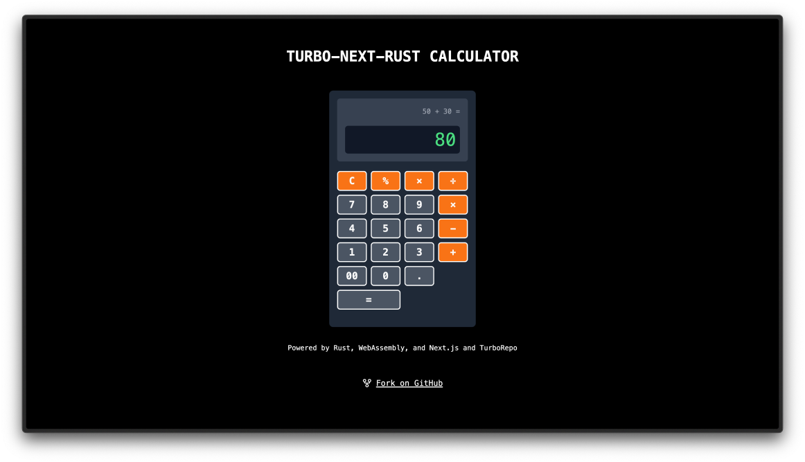

# Turbo-Next-Rust Calculator

A high-performance calculator template leveraging Turborepo, Next.js, Rust, and WebAssembly.




## Features

- **Turborepo**: Efficient monorepo management for scalable projects
- **Next.js 14+**: Modern, fast web development with the latest features
- **Rust & WebAssembly**: High-performance calculations running in the browser
- **Tailwind CSS**: Rapid UI development with utility-first CSS framework
- **TypeScript**: Type-safe code for improved developer experience
- **Dark Mode**: Seamless theme switching with next-themes

## Demo

[View Live Demo](https://your-demo-url-here.vercel.app)




## Quick Start

1. Deploy to Vercel:

   [](https://vercel.com/new/clone?repository-url=https://github.com/yourusername/turbo-next-rust-calculator)

2. Clone the repository:

   ```bash
   git clone https://github.com/yourusername/turbo-next-rust-calculator.git
   cd turbo-next-rust-calculator
   ```

3. Install dependencies:

   ```bash
   pnpm install
   ```

4. Build the Rust WebAssembly module:

   ```bash
   cd packages/rust-math && wasm-pack build
   ```

5. Run the development server:

   ```bash
   pnpm dev
   ```

6. Open [http://localhost:3000](http://localhost:3000) in your browser.

## Project Structure

```
.
├── apps
│   └── web (Next.js application)
│       ├── app
│       ├── components
│       └── ...
└── packages
    ├── eslint-config
    ├── tailwind-config
    ├── typescript-config
    ├── rust-math (Rust WebAssembly module)
    │   ├── src
    │   │   └── lib.rs
    │   └── ...
    └── ui (Shared UI components)
```

## Customization

- Modify the Rust calculations in `packages/rust-math/src/lib.rs`
- Update the UI in `apps/web/components/calculator.tsx`
- Adjust styles in `apps/web/app/globals.css`

## Learn More

To learn more about the technologies used in this template, take a look at the following resources:

- [Turborepo Documentation](https://turbo.build/repo/docs)
- [Next.js Documentation](https://nextjs.org/docs)
- [Rust Programming Language](https://www.rust-lang.org/)
- [WebAssembly](https://webassembly.org/)
- [Tailwind CSS](https://tailwindcss.com/)

## Contributing

Contributions are welcome! Please feel free to submit a Pull Request.